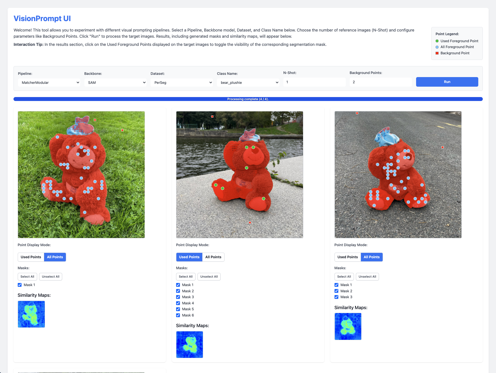

# VisionPrompt

**A flexible and modular framework for exploring, developing, and evaluating visual prompting algorithms.**

---

[](LICENSE) <!-- Add other relevant badges if you have them -->

This project provides a robust platform for experimenting with various visual prompting techniques. Its core strength lies in a highly **modular pipeline design**, allowing researchers and developers to easily combine, swap, and extend different components such as backbone networks, feature extractors, matching algorithms, and mask generators.

## What is Visual Prompting?

Imagine you need to locate and precisely outline every instance of a specific object in hundreds of images—perhaps "kettles" in kitchen photos or "tumors" in medical scans. Traditional approaches would require either:

1. Training a dedicated model on thousands of labeled examples of that specific object, or
2. Manually segmenting each image (extremely time-consuming and labor-intensive)

**Visual prompting** offers a powerful alternative: show the model just _one or a few examples_ of what you're looking for, and it can find and segment similar objects in new images.

At its core, visual prompting is a form of few-shot learning for vision models like SAM (Segment Anything Model). It works by using:

- **Reference images** containing examples of your target object (often with corresponding masks)
- **Feature matching** that compares visual patterns between your reference and target images
- **Guided segmentation** that uses these matches to precisely outline the objects of interest

This approach is particularly valuable when you need to segment rare or novel object categories not well-represented in general training data, or when you can't collect large training datasets due to privacy, time, or resource constraints.

This repository explores algorithms that make visual prompting more effective, efficient, and adaptable to different use cases.

## Key Features

- 🧩 **Modular Pipeline Architecture:** Easily configure pipelines by modifying their Python class definitions to mix and match components (backbones, feature extractors, matchers, etc.). Simplifies experimentation and development of novel approaches.
- 🔬 **Extensive Algorithm & Backbone Support:** Includes implementations for various state-of-the-art algorithms (PerSAM, Matcher, Dino-based methods) and diverse backbone models (SAM, MobileSAM, EfficientViT-SAM, DinoV2).
- 📊 **Comprehensive Evaluation Framework:** Unified evaluation script (`main.py`) with support for multiple datasets (LVIS, PerSeg, etc.) and standard metrics (mIoU, Precision, Recall).
- 💻 **Interactive Web UI:** Visually inspect similarity maps, generated masks, and points for qualitative analysis and debugging. Easily switch between configurations.
- 🔌 **Easy Integration:** Designed for straightforward addition of new algorithms, backbones, or datasets.

## Modular Pipeline Example

The power of this repository lies in its modularity. You can easily modify pipelines by changing which components are instantiated within their class definition.

For instance, here is the complete definition for the `PerSam` pipeline from `context_learner/pipelines/persam_pipeline.py`. It shows how different processing components are instantiated within the `__init__` method to define the pipeline's behavior. 

```python
# context_learner/pipelines/persam_pipeline.py


class PerSam(Pipeline):
    """
    This is the PerSam algorithm pipeline. Its based on the paper "Personalize Segment Anything Model with One Shot"
    https://arxiv.org/abs/2305.03048

    It matches reference objects to target images by comparing their features extracted by SAM and using Cosine Similarity.
    A grid prompt generator is used to generate prompts for the segmenter and to allow for multi object target images.
    """

    def __init__(self, sam_predictor: SamPredictor, args: argparse.Namespace):
        super().__init__(args)

        self.encoder: Encoder = SamEncoder(self._state, sam_predictor)
        # self.feature_selector: FeatureSelector = AverageFeatures(self._state)
        self.feature_selector: FeatureSelector = ClusterFeatures(
            self._state, num_clusters=self.args.num_clusters
        )
        self.similarity_matcher: SimilarityMatcher = CosineSimilarity(self._state)
        self.prompt_generator: PromptGenerator = GridPromptGenerator(
            self._state,
            similarity_threshold=self.args.similarity_threshold,
            num_bg_points=self.args.num_background_points,
        )
        self.segmenter: Segmenter = SamDecoder(
            self._state,
            sam_predictor=sam_predictor,
            apply_mask_refinement=self.args.apply_mask_refinement,
        )
        self.mask_processor: MaskProcessor = MasksToPolygons(self._state)
        self.class_overlap_mask_filter: MaskFilter = ClassOverlapMaskFilter(self._state)

    def learn(self, reference_images: List[Image], reference_priors: List[Priors]):
        s: State = self._state
        s.reference_images = reference_images
        s.reference_priors = reference_priors

        # Start running the pipeline
        s.reference_features, s.processed_reference_masks = self.encoder(
            s.reference_images, s.reference_priors
        )
        s.reference_features = self.feature_selector(s.reference_features)

    def infer(self, target_images: List[Image]):
        s: State = self._state
        s.target_images = target_images

        # Start running the pipeline
        s.target_features, _ = self.encoder(s.target_images)
        s.similarities = self.similarity_matcher(
            s.reference_features, s.target_features
        )
        s.priors = self.prompt_generator(s.similarities)
        s.masks, s.used_points = self.segmenter(s.target_images, s.priors)
        s.masks = self.class_overlap_mask_filter(s.masks, s.used_points)
        s.annotations = self.mask_processor(s.masks)

        return s.annotations
```

To experiment with a different component, such as using `AverageFeatures` instead of `ClusterFeatures` for the feature selection step, you would simply modify the `__init__` method:

```python
# Simply swap out the feature selector:

# self.feature_selector: FeatureSelector = ClusterFeatures(
#     self._state, num_clusters=self.args.num_clusters
# )
self.feature_selector: FeatureSelector = AverageFeatures(self._state)
```

By editing the pipeline definition file directly, you control the specific combination of processing steps used, allowing for rapid prototyping and comparison.

After that, it's simply a question of calling `learn()` on your reference images, and `infer()` after that on your target images. The pipeline handles all the intermediate processing steps internally.

```python
# Example usage
pipeline = PerSam(sam_predictor, args)  

# Learn from reference images
pipeline.learn(reference_images, reference_priors)

# Run inference on target images
annotations = pipeline.infer(target_images)
```

## Installation

Create a new environment and install dependencies. We recommend using `mamba` for faster environment creation.

```bash
# Create environment (using mamba)
mamba create -n visualprompting python=3.11 -y
mamba activate visualprompting

# Or using conda
# conda create -n visualprompting python=3.11 -y
# conda activate visualprompting

# Or using venv
# python -m venv .venv
# source .venv/bin/activate # On Linux/macOS
# .venv\Scripts\activate # On Windows

# Install PyTorch (adjust cuXXX version if needed for your system)
# Check https://pytorch.org/get-started/locally/ for the correct command
pip install torch torchvision torchaudio --index-url https://download.pytorch.org/whl/cu126

# Install core dependencies
pip install -r requirements.txt

# Install local/third-party packages
pip install -e third_party/model_api/model_api/python
pip install -e third_party/dinov2
pip install -e third_party/efficientvit

# (Optional) Install xFormers for efficient attention (adjust CUDA version if needed)
pip install -U xformers --index-url https://download.pytorch.org/whl/cu126
```

### Model Weights

Download the required model weights.

```bash
# Create a directory for data/weights (e.g., in your home directory)
mkdir -p ~/data/
cd ~/data/

# Download SAM-H model weights
wget https://dl.fbaipublicfiles.com/segment_anything/sam_vit_h_4b8939.pth
# Download MobileSAM (SAM-T) model weights
wget https://github.com/ChaoningZhang/MobileSAM/raw/refs/heads/master/weights/mobile_sam.pt
# Download EfficientViT-SAM-L0 model weights
wget https://huggingface.co/mit-han-lab/efficientvit-sam/resolve/main/efficientvit_sam_l0.pt
```

## User Interface

A web-based user interface is available for interactive exploration and qualitative analysis.

```bash
python -m web_ui.app
```

The UI allows selecting different pipelines, datasets, and images to inspect outputs like similarity maps, masks, and points.



## Evaluate on Datasets

Use the main evaluation script `main.py` to benchmark performance.

**Basic Usage:**

```bash
# Evaluate the default pipeline (MatcherModular) on LVIS dataset with 1-shot
python main.py

# Specify dataset and pipeline
python main.py --dataset_name PerSeg --pipeline MatcherModular

# Change number of reference shots
python main.py --n_shot 3

# Select a different backbone
python main.py --sam_name MobileSAM

# Filter evaluation to a specific class
python main.py --class_name cat

# Combine arguments
python main.py --dataset_name PerSeg --pipeline MatcherModular --n_shot 3 --sam_name MobileSAM --class_name can
```

See `utils/args.py` or run `python main.py --help` for all available command-line options. Results (metrics and visualizations) are typically saved to `~/outputs/`.

## Acknowledgements

This project builds upon and utilizes code from several excellent open-source repositories. We thank the authors for their contributions:

- [PerSAM](https://github.com/ZrrSkywalker/Personalize-SAM)
- [P2SAM](https://github.com/Zch0414/P2SAM)
- [Matcher](https://github.com/aim-uofa/Matcher)
- [DinoV2](https://github.com/facebookresearch/dinov2)
- [SAM](https://github.com/facebookresearch/segment-anything)
- [MobileSAM](https://github.com/ChaoningZhang/MobileSAM)
- [EfficientViT-SAM](https://github.com/mit-han-lab/efficientvit/tree/master/applications/efficientvit_sam)
- [ModelAPI](https://github.com/open-edge-platform/model_api)

## License

This project is licensed under the Apache 2.0 License - see the [LICENSE](LICENSE) file for details.
