# Geti Prompt

**A flexible and modular framework for exploring, developing, and evaluating visual prompting algorithms.**

---

[](LICENSE) [](https://www.python.org/downloads/) [](pyproject.toml)

This project provides a robust platform for experimenting with various visual prompting techniques. Its core strength lies in a highly **modular pipeline design**, allowing researchers and developers to easily combine, swap, and extend different components such as backbone networks, feature extractors, matching algorithms, and mask generators.

## What is Visual Prompting?

Imagine you need to locate and precisely outline every instance of a specific object in hundreds of images—perhaps "kettles" in kitchen photos or "tumors" in medical scans. Traditional approaches typically require either:

1. Training a dedicated model on thousands of labeled examples of that specific object, or
2. Manually segmenting each image (extremely time-consuming and labor-intensive)

**Visual prompting** offers a powerful alternative: show the model just _one or a few examples_ of what you're looking for, and it can find and segment similar objects in new images.

At its core, visual prompting is a form of few-shot learning for vision models like SAM (Segment Anything Model). It works by using:

- **Reference images** containing examples of your target object (often with corresponding masks)
- **Feature matching** that compares visual patterns between your reference and target images
- **Guided segmentation** that uses these matches to precisely outline the objects of interest

This approach is particularly valuable when you need to segment rare or novel object categories not well-represented in general training data, or when you can't collect large training datasets due to privacy, time, or resource constraints.

This repository explores algorithms that make visual prompting more effective, efficient, and adaptable to different use cases.

## Key Features

- 🧩 **Modular Pipeline Architecture:** Easily configure pipelines by modifying their Python class definitions to mix and match components (backbones, feature extractors, matchers, etc.). Simplifies experimentation and development of novel approaches.
- 🔬 **Extensive Algorithm & Backbone Support:** Includes implementations for various state-of-the-art algorithms (Matcher, SoftMatcher, Dino-based methods) and diverse backbone models (SAM, MobileSAM, EfficientViT-SAM, DinoV2).
- 📊 **Comprehensive Evaluation Framework:** Unified evaluation script with support for multiple datasets (LVIS, PerSeg, etc.) and standard metrics (mIoU, Precision, Recall).
- 💻 **Interactive Web UI:** Visually inspect similarity maps, generated masks, and points for qualitative analysis and debugging. Easily switch between configurations.
- 🔌 **Easy Integration:** Designed for straightforward addition of new algorithms, backbones, or datasets.

## Installation

Create a new environment and install dependencies. We recommend using `uv` for faster environment creation.

```bash
uv sync

# Install extras (xFormers)
uv sync --extra extras

# Install dev dependencies (ruff, pre-commit)
uv sync --extra dev

# Install all dependencies
uv sync --extra full
```

## Usage

The project is structured around a command-line interface (CLI) with three subcommands: `run`, `benchmark`, and `ui`.

You can get help for any command by using the `-h` or `--help` flag, for example, `getiprompt benchmark --help`.

### Run a Pipeline

The `run` subcommand allows you to execute a pipeline on your own set of images.

**Example:**

```bash
# Run using predefined masks with default pipeline (Matcher)
getiprompt run --reference_images path/to/reference/images --target_images path/to/target/images --reference_prompts path/to/reference/masks

# Run using points
getiprompt run --reference_images path/to/reference/images --target_images path/to/target/images --points "[0:[640,640], -1:[200,200]]"

# Run using text prompt
getiprompt run --target_images path/to/target/images --reference_text_prompt "can"

# Run any other subclass of Pipeline (e.g. SoftMatcher) using MobileSAM
getiprompt run --pipeline SoftMatcher --pipeline.sam MOBILE_SAM ...
```

You can configure the pipeline's parameters using dot notation (e.g., `--pipeline.mask_similarity_threshold`, `--pipeline.device`).

### Benchmark on Datasets

The `benchmark` subcommand is used to evaluate pipeline performance on various datasets. It can be used to test multiple pipelines, datasets, and hyperparameters all in one experiment.

**Basic Usage:**

```bash
# Evaluate the default pipeline on LVIS dataset with 1-shot
getiprompt benchmark

# Specify dataset and pipeline
getiprompt benchmark --dataset_name PerSeg --pipeline Matcher

# Change number of reference shots
getiprompt benchmark --n_shot 3

# Select a different backbone
getiprompt benchmark --sam MobileSAM

# Filter evaluation to a specific class
getiprompt benchmark --class_name cat

# Combine arguments
getiprompt benchmark --dataset_name PerSeg --pipeline MatcherModular --n_shot 3 --sam MobileSAM --class_name can

# Run all pipelines on all datasets
getiprompt benchmark --pipeline all --dataset_name all
```

See [`src/getiprompt/utils/args.py`](src/getiprompt/utils/args.py) or run `getiprompt benchmark --help` for all available command-line options. Results (metrics and visualizations) are typically saved to `~/outputs/`.

### Development UI (Optional)

An interactive web-based development UI is available as a separate application for visual debugging and qualitative analysis. The UI allows you to select different pipelines, datasets, and images to inspect outputs like similarity maps, masks, and points.

To use the Development UI, first install the optional dev_ui dependencies:

```bash
# Install with dev_ui support
uv sync --extra dev_ui

# Or install all optional dependencies
uv sync --extra full
```

Then navigate to the `dev_ui` directory and run it independently:

```bash
cd dev_ui
python app.py
```

By default, it runs on `http://127.0.0.1:5050`. For detailed usage instructions and configuration options, see [`dev_ui/README.md`](dev_ui/README.md)

## Modular Pipeline Example

The power of this repository lies in its modularity. You can easily modify pipelines by changing which components are instantiated within their class definition.

For instance, here is the complete definition for the `PerDino` pipeline from [`context_learner/pipelines/perdino_pipeline.py`](src/getiprompt/context_learner/pipelines/perdino_pipeline.py). It shows how different processing components are instantiated within the `__init__` method to define the pipeline's behavior.

```python
# src/getiprompt/pipelines/perdino_pipeline.py

class PerDino(Pipeline):
    """This is the PerDino algorithm pipeline.

    It matches reference objects to target images by comparing their features extracted by Dino
    and using Cosine Similarity. A grid prompt generator is used to generate prompts for the
    segmenter and to allow for multi object target images.
    """

    def __init__(
        self,
        sam: SAMModelName = SAMModelName.SAM_HQ_TINY,
        encoder_model: str = "dinov3_large",
        num_foreground_points: int = 40,
        num_background_points: int = 2,
        apply_mask_refinement: bool = True,
        skip_points_in_existing_masks: bool = True,
        num_grid_cells: int = 16,
        similarity_threshold: float = 0.65,
        mask_similarity_threshold: float | None = 0.42,
        precision: str = "bf16",
        compile_models: bool = False,
        benchmark_inference_speed: bool = False,
        device: str = "cuda",
        image_size: int | tuple[int, int] | None = None,
    ) -> None:
        """Initialize the PerDino pipeline.

        Args:
            sam: The name of the SAM model to use.
            num_foreground_points: The number of foreground points to use.
            num_background_points: The number of background points to use.
            apply_mask_refinement: Whether to apply mask refinement.
            skip_points_in_existing_masks: Whether to skip points in existing masks.
            num_grid_cells: The number of grid cells to use.
            similarity_threshold: The similarity threshold for the similarity matcher.
            mask_similarity_threshold: The similarity threshold for the mask.
            encoder_model: ImageEncoder model ID to use.
            precision: The precision to use for the model.
            compile_models: Whether to compile the models.
            benchmark_inference_speed: Whether to benchmark the inference speed.
            device: The device to use for the model.
            image_size: The size of the image to use, if None, the image will not be resized.
        """
        super().__init__(image_size=image_size)
        self.sam_predictor = load_sam_model(
            sam,
            device,
            precision=precision,
            compile_models=compile_models,
            benchmark_inference_speed=benchmark_inference_speed,
        )

        self.encoder: ImageEncoder = ImageEncoder(
            model_id=encoder_model,
            device=device,
            precision=precision,
            compile_models=compile_models,
            benchmark_inference_speed=benchmark_inference_speed,
        )
        self.feature_selector: FeatureSelector = AverageFeatures()
        self.similarity_matcher: SimilarityMatcher = CosineSimilarity()
        self.prompt_generator: PromptGenerator = GridPromptGenerator(
            num_grid_cells=num_grid_cells,
            similarity_threshold=similarity_threshold,
            num_bg_points=num_background_points,
        )
        self.point_filter: PriorFilter = MaxPointFilter(
            max_num_points=num_foreground_points,
        )
        self.segmenter: Segmenter = SamDecoder(
            sam_predictor=self.sam_predictor,
            apply_mask_refinement=apply_mask_refinement,
            mask_similarity_threshold=mask_similarity_threshold,
            skip_points_in_existing_masks=skip_points_in_existing_masks,
        )
        self.prior_mask_from_points: PriorFilter = PriorMaskFromPoints(segmenter=self.segmenter)
        self.mask_processor: MaskProcessor = MasksToPolygons()
        self.class_overlap_mask_filter: MaskFilter = ClassOverlapMaskFilter()
        self.reference_features = None

    @track_duration
    def learn(self, reference_images: list[Image], reference_priors: list[Priors]) -> Results:
        """Perform learning step on the reference images and priors."""
        reference_images = self.resize_images(reference_images)
        reference_priors = self.prior_mask_from_points(reference_images, reference_priors)
        reference_priors = self.resize_masks(reference_priors)

        # Start running the pipeline
        reference_features, _ = self.encoder(
            reference_images,
            reference_priors,
        )
        self.reference_features = self.feature_selector(reference_features)

    @track_duration
    def infer(self, target_images: list[Image]) -> Results:
        """Perform inference step on the target images."""
        target_images = self.resize_images(target_images)

        # Start running the pipeline
        target_features, _ = self.encoder(target_images)
        similarities = self.similarity_matcher(self.reference_features, target_features, target_images)
        priors = self.prompt_generator(similarities, target_images)
        priors = self.point_filter(priors)
        masks, used_points, _ = self.segmenter(target_images, priors, similarities)
        masks = self.class_overlap_mask_filter(masks, used_points)
        annotations = self.mask_processor(masks)

        # write output
        results = Results()
        results.priors = priors
        results.used_points = used_points
        results.masks = masks
        results.annotations = annotations
        results.similarities = similarities
        return results
```

To experiment with a different component, such as using `ClusterFeatures` instead of `AverageFeatures` for the feature selection step, you would simply modify the `__init__` method:

```python
# Simply swap out the feature selector:
self.feature_selector: FeatureSelector = ClusterFeatures()
```

By editing the pipeline definition file directly, you control the specific combination of processing steps used, allowing for rapid prototyping and comparison.

After that, it's simply a question of calling `learn()` on your reference images, and `infer()` after that on your target images. The pipeline handles all the intermediate processing steps internally.

```python
# Example usage
pipeline = PerDino()

# Learn from reference images
results = pipeline.learn(reference_images, reference_priors)

# Run inference on target images
results = pipeline.infer(target_images)
```

## Component Overview

The following diagram shows the main components of the pipeline and their relationships.

```mermaid
classDiagram
    class Pipeline {
        +image_size: int | tuple[int, int] | None
        +resize_images(List~Image~) List~Image~
        +resize_masks(List~Priors~) List~Priors~
        +learn(List~Image~, List~Priors~) Results
        +infer(List~Image~) Results
    }

    class Process {
        +__call__(*args) Any
    }

    class Results {
        +priors: List~Priors~
        +used_points: List~Points~
        +masks: List~Masks~
        +annotations: List~Annotations~
        +similarities: List~Similarities~
    }

    class ImageEncoder~Process~ {
        <<Interface>>
        +__call__(List~Image~, List~Priors~) (List~Features~, List~Masks~)
    }
    class FeatureSelector~Process~ {
        <<Interface>>
        +__call__(List~Features~) List~Features~
    }
    class SimilarityMatcher~Process~ {
        <<Interface>>
        +__call__(List~Features~, List~Features~, List~Image~) List~Similarities~
    }
    class PromptGenerator~Process~ {
        <<Interface>>
        +__call__(List~Similarities~, List~Image~) List~Priors~
    }
    class PriorFilter~Process~ {
        <<Interface>>
        +__call__(List~Priors~) List~Priors~
    }
    class Segmenter~Process~ {
        <<Interface>>
        +__call__(List~Image~, List~Priors~) (List~Masks~, List~Points~)
    }
    class MaskProcessor~Process~ {
        <<Interface>>
        +__call__(List~Masks~) List~Annotations~
    }
    class MaskFilter~Process~ {
        <<Interface>>
        +__call__(List~Masks~, List~Points~) List~Masks~
    }

    Pipeline --> Process : uses
    Process --> Results : produces

    class PerDino {
        +SamPredictor sam_predictor
        +ImageEncoder encoder
        +FeatureSelector feature_selector
        +SimilarityMatcher similarity_matcher
        +PromptGenerator prompt_generator
        +PriorFilter point_filter
        +Segmenter segmenter
        +MaskProcessor mask_processor
        +MaskFilter class_overlap_mask_filter
        +List~Features~ reference_features
    }

    class Matcher {
        +SamPredictor sam_predictor
        +ImageEncoder encoder
        +FeatureSelector feature_selector
        +PromptGenerator prompt_generator
        +PriorFilter point_filter
        +Segmenter segmenter
        +MaskProcessor mask_processor
        +MaskFilter class_overlap_mask_filter
        +List~Features~ reference_features
        +List~Masks~ reference_masks
    }

    class SoftMatcher {
        +SamPredictor sam_predictor
        +ImageEncoder encoder
        +FeatureSelector feature_selector
        +PromptGenerator prompt_generator
        +PriorFilter point_filter
        +Segmenter segmenter
        +MaskProcessor mask_processor
        +MaskFilter class_overlap_mask_filter
        +List~Features~ reference_features
        +List~Masks~ reference_masks
    }

    class GroundedSAM {
        +SamPredictor sam_predictor
        +PromptGenerator prompt_generator
        +Segmenter segmenter
        +MaskFilter box_aware_mask_filter
        +MaskFilter multi_instance_prior_filter
        +MaskProcessor mask_processor
        +MaskFilter class_overlap_mask_filter
        +Text text_priors
    }

    Pipeline <|-- PerDino
    Pipeline <|-- Matcher
    Pipeline <|-- SoftMatcher
    Pipeline <|-- GroundedSAM

    PerDino o--> ImageEncoder : uses
    PerDino o--> FeatureSelector : uses
    PerDino o--> SimilarityMatcher : uses
    PerDino o--> PromptGenerator : uses
    PerDino o--> PriorFilter : uses
    PerDino o--> Segmenter : uses
    PerDino o--> MaskProcessor : uses
    PerDino o--> MaskFilter : uses

    Matcher o--> ImageEncoder : uses
    Matcher o--> FeatureSelector : uses
    Matcher o--> PromptGenerator : uses
    Matcher o--> PriorFilter : uses
    Matcher o--> Segmenter : uses
    Matcher o--> MaskProcessor : uses
    Matcher o--> MaskFilter : uses

    SoftMatcher o--> ImageEncoder : uses
    SoftMatcher o--> FeatureSelector : uses
    SoftMatcher o--> PromptGenerator : uses
    SoftMatcher o--> PriorFilter : uses
    SoftMatcher o--> Segmenter : uses
    SoftMatcher o--> MaskProcessor : uses
    SoftMatcher o--> MaskFilter : uses

    GroundedSAM o--> PromptGenerator : uses
    GroundedSAM o--> Segmenter : uses
    GroundedSAM o--> MaskProcessor : uses
    GroundedSAM o--> MaskFilter : uses

    class ImageEncoder
    class AverageFeatures
    class ClusterFeatures
    class AllFeaturesSelector
    class CosineSimilarity
    class GridPromptGenerator
    class BidirectionalPromptGenerator
    class SoftmatcherPromptGenerator
    class GroundedObjectDetector
    class MaxPointFilter
    class SamDecoder
    class MasksToPolygons
    class ClassOverlapMaskFilter

    ImageEncoder <|-- ImageEncoder
    FeatureSelector <|-- AverageFeatures
    FeatureSelector <|-- ClusterFeatures
    FeatureSelector <|-- AllFeaturesSelector
    SimilarityMatcher <|-- CosineSimilarity
    PromptGenerator <|-- GridPromptGenerator
    PromptGenerator <|-- BidirectionalPromptGenerator
    PromptGenerator <|-- SoftmatcherPromptGenerator
    PromptGenerator <|-- GroundedObjectDetector
    PriorFilter <|-- MaxPointFilter
    Segmenter <|-- SamDecoder
    MaskProcessor <|-- MasksToPolygons
    MaskFilter <|-- ClassOverlapMaskFilter

    ImageEncoder --|> Process
    AverageFeatures --|> Process
    ClusterFeatures --|> Process
    AllFeaturesSelector --|> Process
    CosineSimilarity --|> Process
    GridPromptGenerator --|> Process
    BidirectionalPromptGenerator --|> Process
    SoftmatcherPromptGenerator --|> Process
    GroundedObjectDetector --|> Process
    MaxPointFilter --|> Process
    SamDecoder --|> Process
    MasksToPolygons --|> Process
    ClassOverlapMaskFilter --|> Process
```



## Acknowledgements

This project builds upon and utilizes code from several excellent open-source repositories. We thank the authors for their contributions. A full list of third party software can be found in the [third-party-programs.txt](third-party-programs.txt) file.

## License

This project is licensed under the Apache 2.0 License - see the [LICENSE](LICENSE) file for details.
